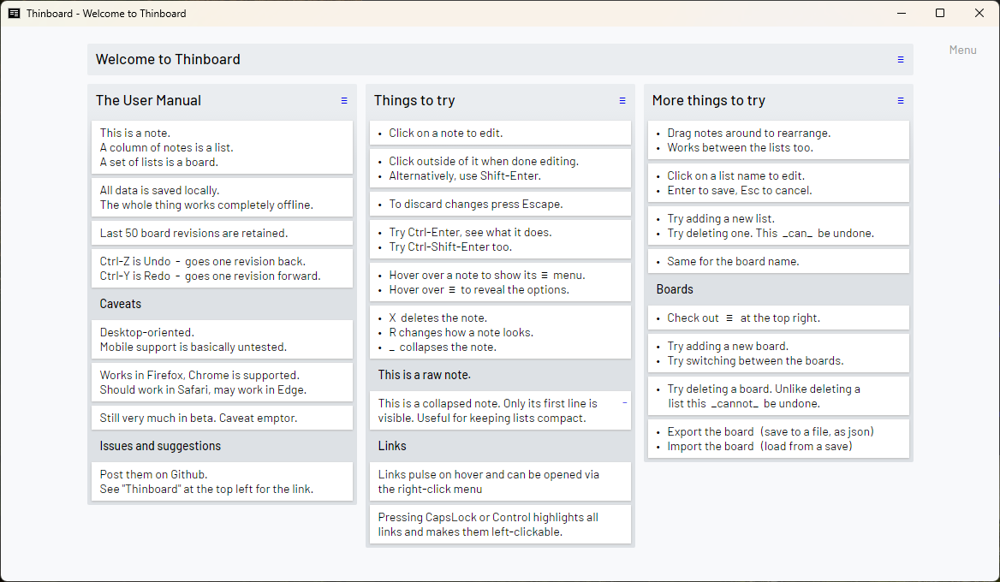
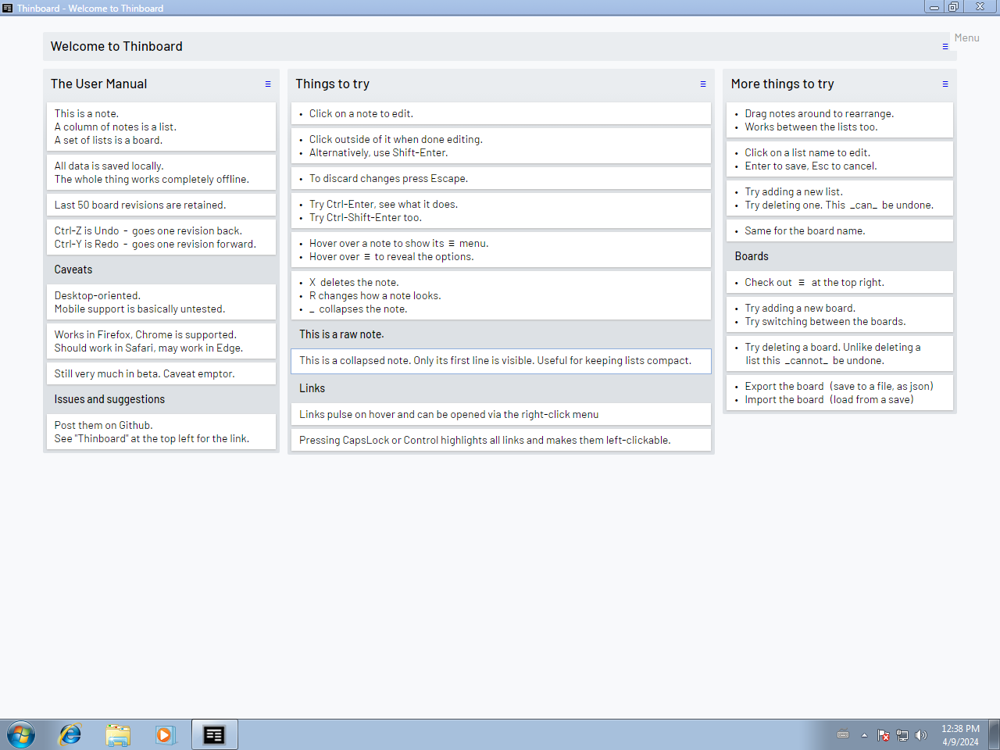

# Thinboard

Thinboard is a minimalist take on a kanban board / a task list manager, designed to be compact, readable and quick in use.

Forked from : [Nullboard](https://github.com/apankrat/nullboard)

Unlike Nullboard you don't have to **worry about deleting your browser cache** because everything is stored in the app itself. \
Its compatible with XP, Vista, Windows 7, Windows 8.x , Windows 10+  \
\
Low resource usage **(Avg. 50-60 MB Memory, 100 MB Disk Space).**

Thinboard on Windows 11

Thinboard on Windows 7

## Dead simple

* Single-page  - just one HTML file, an ancient jQuery package and a webfont pack packed as NW.js app.
* Low resource usage, compatible with old systems.
* Can be used completely offline. In fact, it's written exactly with this use in mind.
* Small patches applied in order to increase the compability with NW.js.

## Locally stored

* All data is stored locally, for now using [localStorage](https://developer.mozilla.org/en/docs/Web/API/Window/localStorage).
* The data can be exported to- or imported from a plain text file in a simple JSON format.

Also:

* Support for multiple boards with near-instant switching
* Undo/redo for 50 revisions per board (configurable in the code)
* Keyboard shortcuts, including Tab'ing through notes

## Caveats

* Written for desktop and keyboard/mouse use
* Uses localStorage for storing boards/lists/notes, ~~-so be careful around [clearing your cache](https://stackoverflow.com/questions/9948284/how-persistent-is-localstorage)~~

You spot a bug, file an issue.

## License

The [2-clause BSD license](https://opensource.org/licenses/BSD-2-Clause/) with the [Commons Clause](https://commonsclause.com/).

That is, you can use, change and re-distribute it for as long as you don't try and sell it.